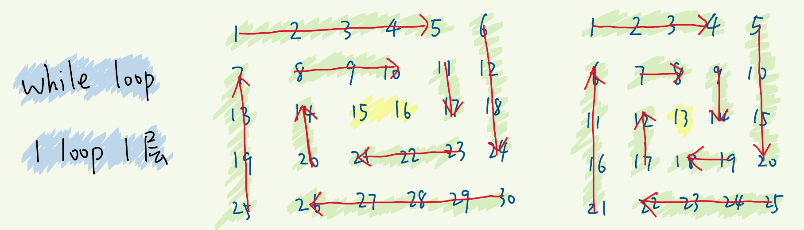

# 顺时针打印矩阵

```
输入一个矩阵，按照从外向里以顺时针的顺序依次打印出每一个数字。

 

示例 1：

输入：matrix = [[1,2,3],[4,5,6],[7,8,9]]
输出：[1,2,3,6,9,8,7,4,5]
示例 2：

输入：matrix = [[1,2,3,4],[5,6,7,8],[9,10,11,12]]
输出：[1,2,3,4,8,12,11,10,9,5,6,7]
 

限制：

0 <= matrix.length <= 100
0 <= matrix[i].length <= 100
```

## 解法一



```js
const spiralOrder = (matrix) => {
    if (matrix.length == 0) return [];
    const res = [];

    let top = 0;
    let bottom = matrix.length - 1;
    let left = 0;
    let right = matrix[0].length - 1;

    while (top < bottom && left < right) {
        for (let i = left; i < right; i++) res.push(matrix[top][i]);   // 上层
        for (let i = top; i < bottom; i++) res.push(matrix[i][right]); // 右层
        for (let i = right; i > left; i--) res.push(matrix[bottom][i]);// 下层
        for (let i = bottom; i > top; i--) res.push(matrix[i][left]);  // 左层
        right--;
        top++;
        bottom--;
        left++;
    }
    if (top == bottom) { // 剩下一行，从左到右依次添加
        for (let i = left; i <= right; i++) {
            res.push(matrix[top][i]);
        }
    } else if (left == right) { // 剩下一列，从上到下依次添加
        for (let i = top; i <= bottom; i++) {
            res.push(matrix[i][left]);
        }
    }
    return res;
};
```

## 解法二


```js
const spiralOrder = (matrix) => {
    if (matrix.length == 0) return [];
    const res = [];

    let top = 0;
    let bottom = matrix.length - 1;
    let left = 0;
    let right = matrix[0].length - 1;

    while (top <= bottom && left <= right) {
        for (let i = left; i <= right; i++) {
            res.push(matrix[top][i]);
        }
        top++;
        for (let i = top; i <= bottom; i++) {
            res.push(matrix[i][right]);
        }
        right--;

        if (top > bottom || left > right) break;

        for (let i = right; i >= left; i--) {
            res.push(matrix[bottom][i]);
        }
        bottom--;
        for (let i = bottom; i >= top; i--) {
            res.push(matrix[i][left]);
        }
        left++;
    }
    return res;
};

```