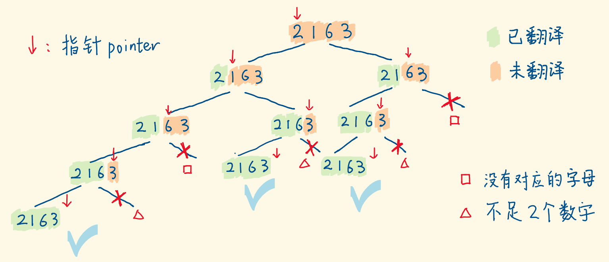

# 把数字翻译成字符串

```
给定一个数字，我们按照如下规则把它翻译为字符串：0 翻译成 “a” ，1 翻译成 “b”，……，11 翻译成 “l”，……，25 翻译成 “z”。一个数字可能有多个翻译。请编程实现一个函数，用来计算一个数字有多少种不同的翻译方法。

 

示例 1:

输入: 12258
输出: 5
解释: 12258有5种不同的翻译，分别是"bccfi", "bwfi", "bczi", "mcfi"和"mzi"
 

提示：

0 <= num < 231
```

## DFS

每次都有2种选择：翻译1个数、或2个数，但有的两位数没有对应字母，翻译2个数这个选项就被砍掉。

指针从左往右扫描，画出下图，2 种选择对应 2 个分支，1 种选择对应 1 个分支。

当指针到达边界和正好越界，都返回 1。这使得下图 △△ 分支返回 0。成为死支。



+ dfs 函数求：「当前指针位置到末尾的数字」的翻译方法数。
+ 节点的状态用指针表示，dfs 入口传 0。
+ 如果 指针 和 指针+1 对应的两位数处于`[10,25]`，则可以直译，有两种选择：
  + 翻译 1 个数，指针走一步，递归调用 dfs，返回出剩余数字的翻译方法数。
  + 翻译 2 个数，指针走两步，递归调用 dfs，返回出剩余数字的翻译方法数。
  + 二者相加，就是当前数字串的翻译方法数。
+ 如果 指针 和 指针+1 对应的两位数超出[10, 25]，则无法直译，只有一个选择：
  + 翻译 1 个数，指针走一步，递归调用 dfs，返回出剩余子串的翻译方法数。


```js
const translateNum = (num) => {
  const str = num.toString();

  const dfs = (str, pointer) => {            // 随着dfs向下，pointer右移
    if (pointer >= str.length - 1) return 1; // 指针抵达边界和超出边界都返回1

    const temp = Number(str[pointer] + str[pointer + 1]);   // 考察该2位数

    if (temp >= 10 && temp <= 25) {          
      return dfs(str, pointer + 1) + dfs(str, pointer + 2); // 2个分支的结果相加
    } else {                                
      return dfs(str, pointer + 1);          // 返回1个分支的结果
    }
  }

  return dfs(str, 0);
}
```

对上面代码进行记忆优化

先往 memo 存入两个已知的、处于底部的子树的结果。等 dfs 往下遇到它，就能直接从 memo 中拿出来用。递归的结果从下往上返回的过程中，子树的计算结果不断抄录到 memo 中

```js
const translateNum = (num) => {
  const str = num.toString();
  const n = str.length;

  const memo = new Array(n);
  memo[n - 1] = 1;   // 指针临界时的子树的计算结果
  memo[n] = 1;       // 指针越界时的子树的计算结果

  const dfs = (str, pointer, memo) => {
    if (memo[pointer]) return memo[pointer]; // 之前存过，直接拿来用

    const temp = Number(str[pointer] + str[pointer + 1]);

    if (temp >= 10 && temp <= 25) {
      memo[pointer] = dfs(str, pointer + 1, memo) + dfs(str, pointer + 2, memo);
    } else {
      memo[pointer] = dfs(str, pointer + 1, memo);
    }

    return memo[pointer]; // 当前子树的计算结果向上返回
  };

  return dfs(str, 0, memo);
}
```

## 动态规划

前两个方法是递归，不断压栈再不断出栈。是自上而下解决问题，等待下面返回上来的结果。动态规划是自下而上解决问题，从已知的 case 出发，存储前面的状态，迭代出最后的结果。动态规划就是想办法不用递归，利用递推关系用“填表格”的方式顺序计算。每个 dp 项的值其实等于一个递归子调用的结果（递归子问题的解）。

```js
const translateNum = (num) => {
  const str = num.toString();
  const n = str.length;

  const dp = new Array(n + 1);
  dp[0] = 1;
  dp[1] = 1;

  for (let i = 2; i < n + 1; i++) {
    const temp = Number(str[i - 2] + str[i - 1]);
    if (temp >= 10 && temp <= 25) {
      dp[i] = dp[i - 1] + dp[i - 2];
    } else {
      dp[i] = dp[i - 1];
    }
  }
  
  return dp[n]; // 翻译前n个数的方法数，即翻译整个数字
}
```


刚才的时间复杂度是O(n)，n 是状态转移的次数，空间复杂度是 O(n)。

你会发现，当前 dp 项只和它前面两项有关，无需用数组存储所有的 dp 项。用两个变量去存这两个状态值，在迭代中更新就好。空间复杂度可以优化到 O(1)。

```js
const translateNum = (num) => {
  const str = num.toString();
  const n = str.length;

  let prev = 1;
  let cur = 1;

  for (let i = 2; i < n + 1; i++) {
    const temp = Number(str[i - 2] + str[i - 1]);
    if (temp >= 10 && temp <= 25) {
      const t = cur;    // 缓存上个状态
      cur = prev + cur; // 当前状态 = 上上个状态 + 上个状态
      prev = t;         // 更新上上个状态
    } else {
      // cur = cur
      prev = cur;       // 这里容易忘了
    }
  } 
  
  return cur;
}
```
